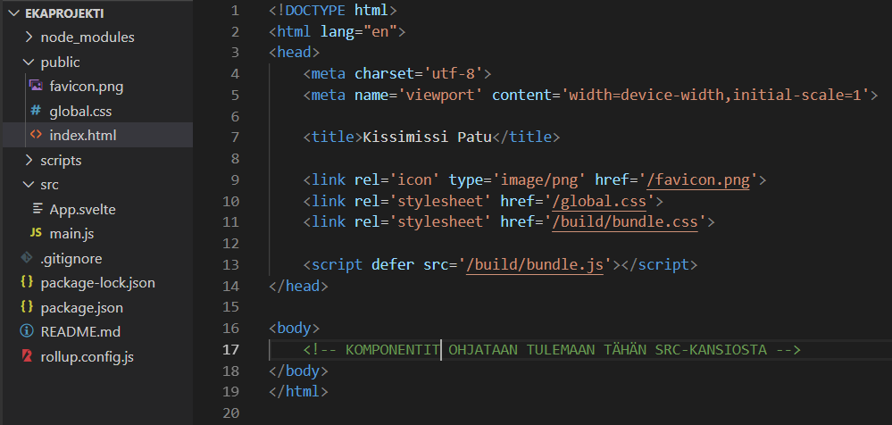
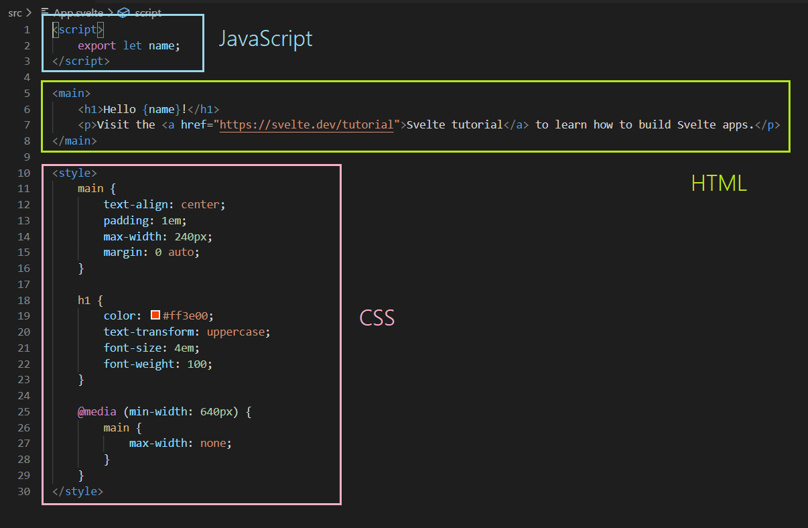

# Frontend perusteet

## Mitä on frontend?

Frontend on sovelluksen käyttäjälle näkyvä osuus eli käyttöliittymä.

Frontend-kehittäminen on siis käyttöliittymän kehittämisestä. Kehitystyö tehdään yhdistämällä kolmea ohjelmointikieltä: HTML, CSS ja JavaScript. Näistä HTML-kielellä luodaan sivuston/sovelluksen rakenne, CSS:llä muokataan sen ulkonäköä ja JavaScriptillä sivustolle/sovellukselle saadaan toiminnallisuuksia.

## Miten käyttöliittymää kehitetään?

Vanha tapa on luoda sovellukseen omat HTML-, CSS- ja JS-tiedostot, jotka linkitetään yhteen. Jokainen sivunäkymä on oma HTML-tiedosto, jolla on oltava HTML-rakenne (<!DOCTYPE html> <html> <head> <body>). Alla on koodin pätkä HTML-tiedoston head-tagin sisällöstä.

```html
<head>
  <meta charset="UTF-8" />
  <meta name="description" content="Treenataan html-koodausta" />
  <meta name="keywords" content="HTML, CSS, kissat" />
  <meta name="author" content="Hullu kissanainen" />

  <title>Kissimissi Patu</title>
  <!--NÄMÄ LINKITYKSET LINKITTÄVÄT HTML-SIVUUN CSS-TIEDOSTON MUOTOILUT JA JAVASCRIPTIN TOIMINNALLISUUDET -->
  <link href="kissimissi_muotoilut.css" rel="stylesheet" type="text/css" />
  <script type="text/javascript" src="snowstorm.js"></script>
  <!--JavaScript-koodi joka lisää sivustolle lumisateen-->
</head>
```

Jos sovelluksessa olisi esimerkiksi 10 sivua, tämä jouduttaisiin kirjoittamaan 10 kertaa. Ja jos myöhemmin huomattaisiin, että pitää lisätä esimerkiksi lisää JS-tiedostoja sovellukseen, muokkaukset pitäisi tehdä kaikkiin kymmeneen HTML-tiedostoon erikseen. Tai jos sovelluksessa on navigaatio sivulta toiselle, sen koodin joutuu kopioimaan jokaiseen HTML-tiedostoon.

Tällaisen sovelluksen ylläpito vaatii tarkkuutta ja riski tehdä virheitä on suuri.

## Framework helpottaa elämää

Jotta säästyttäisiin toistuvan koodin kirjoittamiselta, on kehitelty **framework** eli ohjelmistokehys. Frameworkit kokoavat HTML-, CSS- ja JavaScript-koodit samaan nyyttiin. Nämä nyytit ovat **komponentteja**.

Frameworkejä on paljon erilaisia eri kehittäjiltä. Tunnetuimmat ja käytetyimmät ovat React, Angular ja Vue. Näistä React on Facebookin kehittämä, Angular Googlen kehittämä ja Vue on avoimeen lähdekoodiin perustuva, laajan kehitystiimin aikaansaannos. Tällä kurssilla tullaan käyttämään frameworkiä Svelte, joka on myös avoimeen lähdekoodiin perustuva, vuonna 2016 kehitetty, framework.

## Mitä se framework tekee käytännössä?

Kun luo uuden framework-projektin, framework luo automaattisesti sovellukselle perusrakenteen. Perusrakenteeseen kuuluu mm. HTML-dokumenttipohja, koko sovelluksen kattavat muotoilut (CSS, SCSS tai vastaava variaatio), komponenttipohjan, tiedostot jotka kokoavat kaikki sovelluksen meta-tiedot sisältävä paketti-tiedosto jne.

Alla olevassa kuvassa näkyy mitä vastaluodussa frameworkissa on.

Koko sovelluksessa on vain tämä yksi HTML-tiedoston rakenne. Varmaan huomasit, että body-tagien sisältö on tyhjä. Normaalisti siihen alettaisiin koota sisältöä kuten nav, main, div, footer jne. Frameworkeissa tämä sisältö kootaan sovellukseen luoduista komponenteista.


Komponentti koostuu omasta HTML-osuudesta, joka on vain tietty pätkä HTML-koodia. Koska public-kansion index.html-tiedostossa on jo pakollinen HTML-rakenne, mutta ei sisältöä body-tagien sisällä, komponentissa on siihen tuleva sisältö. Tässä tapauksessa main-tagien sisällä oleva sisältö.

Javascript on perinteisesti script-tagien sisällä.

Lisäksi komponentissa on oma CSS-osuus, joka muotoilee vain tämän kyseisen komponentin sisältöä. Jos tahtoo tehdä muotoiluita, jotka kattavat koko sovelluksen, ne kannattaa tehdä public-kansion global.css-tiedostoon.

**HUOM!** Koska frameworkejä on erilaisia, komponenttien rakenne vaihtelee myös. Joissain komponentti on vain yksi tiedosto, joka pitää sisällään HTML, CSS ja JavaScript-osuudet, kuten tässä esimerkissä. Toisissa frameworkeissä komponetti saattaa olla oma kansionsa, jonka sisällä on erikseen tiedostot näille kolmelle osiolle.
