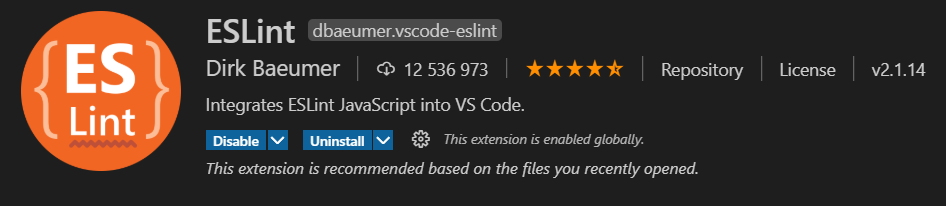
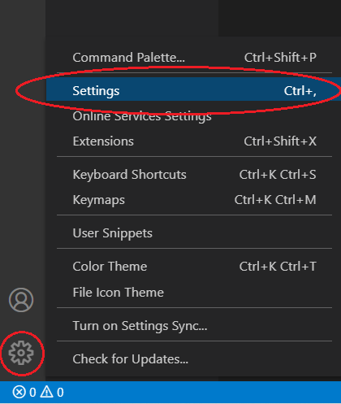
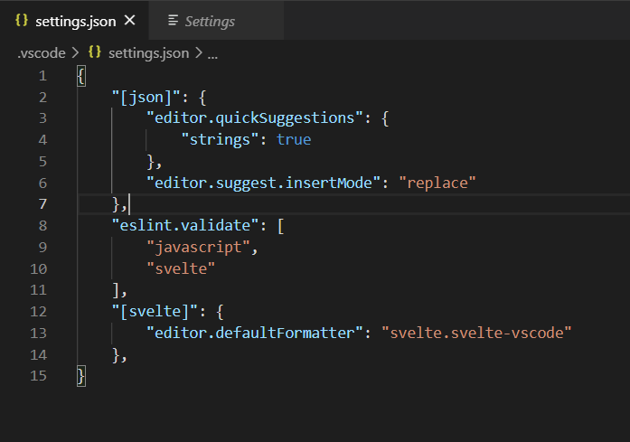
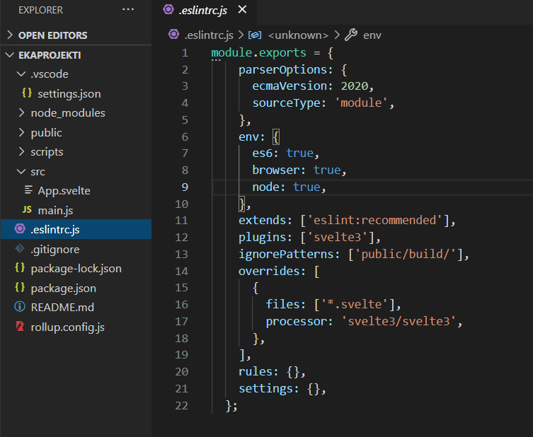

## Ympäristön pystyttäminen

### Kuinka päästään alkuun?

Ensin laitetaan kehitysympärisö kuntoon. Tähän tarvitaan:

- [VSCode](https://code.visualstudio.com/)
- [NodeJS](https://nodejs.org/en/)

Luo koneellesi kansio, johon tulet luomaan tulevan projektisi, esim. Frontend.


Avaa VS Code ja avaa uusi terminaali.


Varmista terminaalissa, että olet äsken luomassasi Frontend-kansiossa.


Tämän jälkeen terminaaliin annetaan komento:

```bash
npm install –g degit
```

Tämä asentaa (install) tarvittavan degit-paketin globaalisti (-g) koneelle. Npm-komennot eivät toimi ilman nodeJS:n asentamista.

Kun tämä on asennettu, voidaan antaa komento joka luo projektin:

```bash
degit sveltejs/template ekaprojekti
```

Nyt projekti on luotu! Näet sen vasemmalla, jos avaat kansiorakennetta.


Kannattaa siirtyä luotuun tiedostoon, joko terminaali komennolla:

```bash
cd ekaprojekti
```

Tai avaamalla VSCoden yläkulmasta File -> Open Folder ja avaamalla siellä ekaprojekti-kansion


### Lisäapuja ohjelmointiin

Jotta koodaaminen olisi helpompaa, asennetaan VS Codeen pari lisäosaa:

**Svelte for VS Code**


**ESLint**



Jotta lintteri saadaan toimimaan, täytyy VSCoden asetuksiin tehdä hieman lisäyksiä.



Haetaan asetuksista tiedosto `settings.json` ja avataan se muokkauksia varten.


Lisää `settings.json`-tiedostoon seuraavat rivit:

```json
"eslint.validate": ["javascript", "svelte"],
"[svelte]": {
  "editor.defaultFormatter": "svelte.svelte-vscode"
},
```



Seuraavaksi annetaan terminaaliin komento:

```bash
 npm i
 npm i -D eslint eslint-plugin-svelte3
```

Seuraavaksi luodaan ekaprojekti-hakemiston sisälle tiedosto `.eslintrc.js`.
Tiedoston sisälle laitetaan seuraava sisältö:

```js
module.exports = {
  parserOptions: {
    ecmaVersion: 2020,
    sourceType: "module",
  },
  env: {
    es6: true,
    browser: true,
    node: true,
  },
  extends: ["eslint:recommended"],
  plugins: ["svelte3"],
  ignorePatterns: ["public/build/"],
  overrides: [
    {
      files: ["*.svelte"],
      processor: "svelte3/svelte3",
    },
  ],
  rules: {},
  settings: {},
};
```



Näillä päästään alkuun!

**HUOM!** Jos ESLint ei lähde toimimaan palaa luomaasi `.eslintrc.js`-tiedostoon. Jos module-sana on alleviivattuna, sinun tulee antaa lupa modulen sisällölle lupa toimia projektissa. Alleviivauksen vieressä pitäisi olla pieni hehkulamppuikoni, jota painamalla pääset valitsemaan oikeuksien antamisesta. Anna modulelle oikeudet toimia koko projektissa.

Sovellus käynnistyy komennolla:

```bash
npm run dev
```
