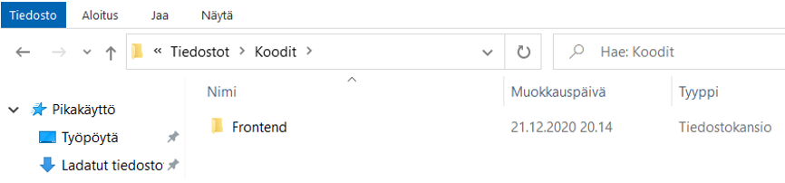
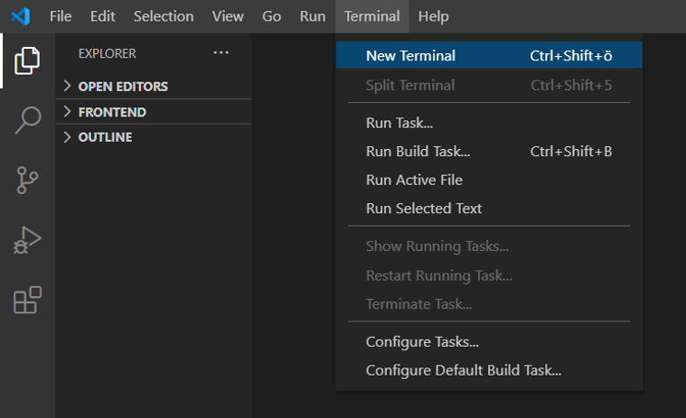
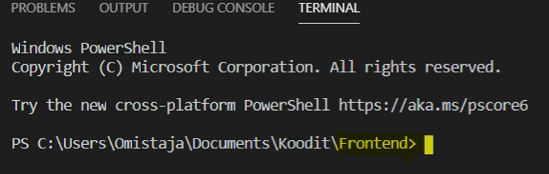
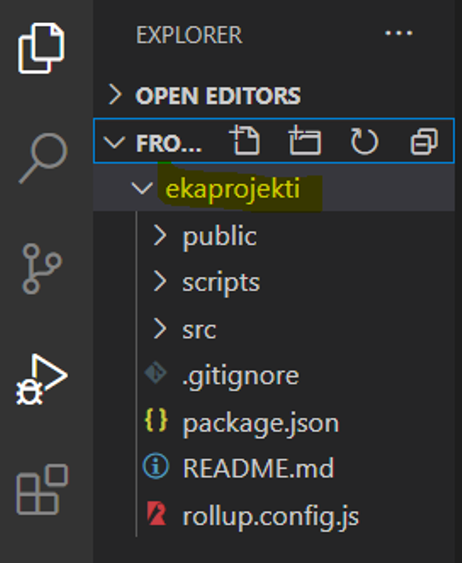
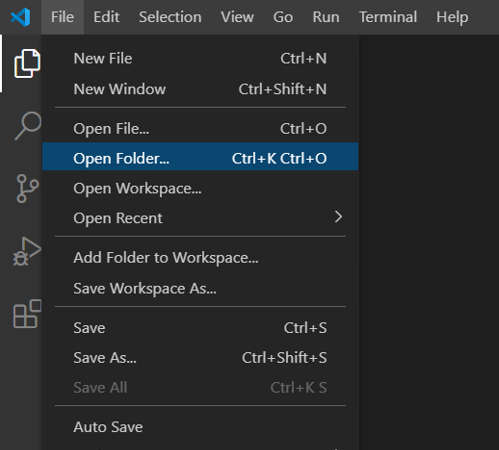
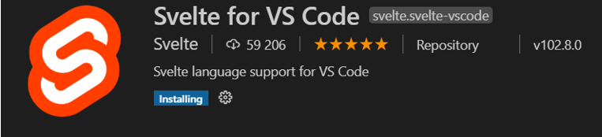
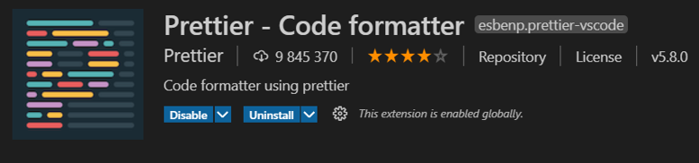

## Ympäristön pystyttäminen

### Kuinka päästään alkuun?

Ensin laitetaan kehitysympärisö kuntoon. Tähän tarvitaan:

- [VSCode](https://code.visualstudio.com/)
- [NodeJS](https://nodejs.org/en/)

Luo koneellesi kansio, johon tulet luomaan tulevan projektisi, esim. Frontend.



Avaa VS Code ja avaa uusi terminaali.



Varmista terminaalissa, että olet äsken luomassasi Frontend-kansiossa.



Tämän jälkeen terminaaliin annetaan komento:

```
npm install –g degit
```

Tämä asentaa (install) tarvittavan degit-paketin globaalisti (-g) koneelle. Npm-komennot eivät toimi ilman nodeJS:n asentamista.

Kun tämä on asennettu, voidaan antaa komento joka luo projektin:

```
degit sveltejs/template ekaprojekti
```

Nyt projekti on luotu! Näet sen vasemmalla, jos avaat kansiorakennetta.



Kannattaa siirtyä luotuun tiedostoon, joko terminaali komennolla:

```
cd ekaprojekti
```

Tai avaamalla VSCoden yläkulmasta File -> Open Folder ja avaamalla siellä ekaprojekti-kansion



### Lisäapuja ohjelmointiin

Jotta koodaaminen olisi helpompaa, asennetaan VS Codeen pari lisäosaa:

**Svelte for VS Code**



**Prettier**


Prettier ei alunperin ole luotu tukemaan Svelteä, joten joudumme laittamaan terminaaliin vielä komennon:

```
npm i --save-dev prettier-plugin-svelte prettier
```

Näillä päästään alkuun!

Sovellus käynnistyy komennolla:

```
npm run dev
```
